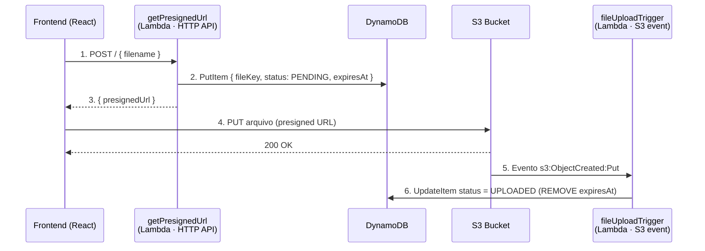
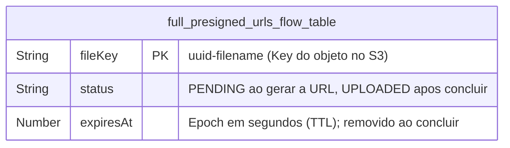

# Full Presigned URLs Flow


Fluxo completo de upload de arquivos para o **Amazon S3** usando **presigned URLs**, com rastreamento do estado de cada upload no **DynamoDB**.

O navegador nunca envia o arquivo para a API: ele pede uma URL pré-assinada, faz o `PUT` **direto no S3** e um gatilho de evento do S3 marca o upload como concluído. Isso mantém as funções da API leves e o tráfego de arquivos fora do backend.

## Como funciona



1. **Frontend** seleciona os arquivos (PNG/JPG/JPEG, até 5 MB) e pede uma presigned URL por arquivo.
2. **`getPresignedUrl`** valida o nome, gera uma chave única (`uuid-filename`), cria a presigned URL de `PutObject` (válida por 1h) e grava no DynamoDB um registro `{ fileKey, status: "PENDING", expiresAt }`.
3. **Frontend** faz o `PUT` do arquivo direto no S3, com barra de progresso.
4. O S3 dispara o evento `ObjectCreated:Put`, e **`fileUploadTrigger`** atualiza o registro para `status: "UPLOADED"` e remove o `expiresAt`.

Registros que ficam `PENDING` (upload nunca concluído) são limpos automaticamente pelo **TTL** do DynamoDB via o atributo `expiresAt`.

## Stack

| Camada | Tecnologias |
| ------ | ----------- |
| **Frontend** | React 19, Vite, Tailwind CSS v4, Base UI, `tw-animate-css`, `react-dropzone`, `axios`, `motion`, Zod |
| **Backend** (`lambdas`) | AWS Lambda (Node.js 24, arm64), Serverless Framework v4 (esbuild), Amazon S3, Amazon DynamoDB (PITR + TTL), HTTP API (API Gateway v2), Zod |
| **Tooling** | pnpm workspaces, Biome, Husky, lint-staged, commitlint |

## Modelo de dados (DynamoDB)



## Pré-requisitos

- Node.js + [pnpm](https://pnpm.io/) `^11.5.0`
- Conta AWS com credenciais configuradas (`aws configure`)
- [Serverless Framework](https://www.serverless.com/) v4 (`npm i -g serverless`)

## Setup

**1. Instale as dependências** (na raiz do monorepo):

```bash
pnpm install
```

**2. Faça o deploy do backend** — provisiona o bucket S3, a tabela DynamoDB e as funções `getPresignedUrl` e `fileUploadTrigger`:

```bash
cd lambdas
serverless deploy
```

Ao final, **copie a URL do HTTP API** exibida no output (`BUCKET_NAME` e `TABLE_NAME` são injetadas automaticamente nas funções).

**3. Configure o frontend** — crie `frontend/.env` com a URL do passo anterior:

```env
VITE_API_URL=https://<seu-id>.execute-api.us-east-1.amazonaws.com
```

**4. Rode o frontend:**

```bash
cd frontend
pnpm dev
```

### Scripts do frontend

| Comando | Descrição |
| ------- | --------- |
| `pnpm dev` | Servidor de desenvolvimento |
| `pnpm build` | Build de produção |
| `pnpm preview` | Pré-visualiza o build local |
